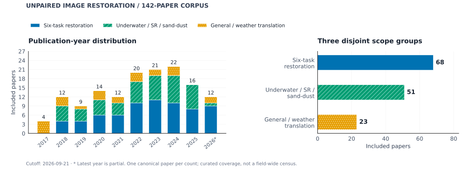

# Citation-linked paper corpus: unpaired image restoration

[Back to the resource overview](../README.md)

**142 canonical papers · cutoff 2026-09-21 · 2026 is a partial year.**

This corpus covers six restoration tasks, broader restoration settings and general/weather translation. Every row has a canonical identifier, a citation key, a primary paper link and a publication-year basis. The annual chart and table below count exactly this CSV.

## Scope and counting

- **Six-task restoration (68):** denoising, deblurring, dehazing, low-light enhancement, deraining and desnowing.
- **Broader restoration (51):** underwater enhancement, super-resolution and sand/dust removal.
- **General/weather translation (23):** general unpaired image translation, night/day and adverse-weather translation. A methodological or forward weather-generation contribution is not automatically an evaluated inverse-restoration method.

Each canonical paper belongs to one count group, so these three groups sum to the total. Task tags can overlap. Preprint/final versions and citation aliases are merged; the `citation_key` column preserves the bibliography mapping. Years use the final proceedings or journal issue when verified, otherwise the first public preprint year. The current year is incomplete.

The collection is a bounded literature snapshot, not an estimate of all worldwide publications. A zero count means no included record, not that no relevant work existed. The counts do not measure quality, popularity or restoration performance.

## Annual counts

[Paper CSV](../data/public_search_papers.csv) · [Annual-count CSV](../data/public_search_year_counts.csv) · [Discovery-query ledger](../data/public_search_queries.csv)

| Year | Total | Six-task restoration | Underwater / SR / sand-dust | General / weather translation |
|---|---:|---:|---:|---:|
| 2017 | 4 | 0 | 0 | 4 |
| 2018 | 12 | 4 | 5 | 3 |
| 2019 | 9 | 4 | 4 | 1 |
| 2020 | 14 | 6 | 5 | 3 |
| 2021 | 12 | 6 | 4 | 2 |
| 2022 | 20 | 10 | 7 | 3 |
| 2023 | 21 | 11 | 8 | 2 |
| 2024 | 22 | 10 | 9 | 3 |
| 2025 | 16 | 8 | 8 | 0 |
| 2026 (partial) | 12 | 9 | 1 | 2 |
| **Total** | **142** | 68 | 51 | 23 |

## Relationship to the selected reading guide

The [selected reading guide](../data/papers.csv) contains 82 records, including historical foundations and adjacent supervision settings. It overlaps this corpus in 64 papers. It is a reading selection, not another group to add to the corpus total. The primary overview and annual chart use this complete counted corpus.

## Evidence and access

Primary links point to publisher/proceedings pages, author manuscripts, project pages or attributable repositories. Restoration entries document an independent-domain branch; internally generated pseudo pairs are allowed. Auxiliary depth, event observations, semantic/quality networks and pretrained priors are recorded in the access notes. These methods therefore do not all have an identical supervision budget.

General translation is counted separately from restoration, including forward degradation generation. Noisy-only or single-image methods, same-scene reference guidance and methods relying on source-paired supervision without an established independent-domain branch are not automatically counted as unpaired restoration. Unresolved cases remain excluded from the counted corpus.

The query ledger records the earlier main discovery pass; later coverage expansion used exact-title, publication-year, author-code and task-specific searches for underwater enhancement, super-resolution, sand/dust removal and general/weather translation. It is not an export of every search result. Not every full implementation has been audited. Blank code links mean an attributable implementation was not verified, not that none exists. Release status and access qualifications remain visible below. The corpus contains bibliography and resource metadata, without benchmark measurements.

## Rebuild and contribute

Run `python scripts/build_public_search.py` to rebuild this page, the annual CSV and chart from the public paper CSV. `python scripts/build_resources.py` refreshes these outputs along with the other resource indexes. Run `python scripts/check_public_bundle.py` for bundle validation. An optional `--check-bbl PATH` checks that every citation key appears in a supplied compiled bibliography; the bibliography itself is not copied into this repository. Corrections should provide a primary URL, access evidence and a publication-year basis; see [CONTRIBUTING.md](../CONTRIBUTING.md).

## Included papers and access notes

### 2026

| Paper / method | Venue · count group | Tasks | Access qualification / code |
|---|---|---|---|
| **N2D3** · [Night-to-Day Translation via Illumination Degradation Disentanglement](https://doi.org/10.1109/TMM.2026.3700823) | IEEE Trans. Multimedia · General / weather translation | night-to-day translation | unpaired night/day translation with physical priors and contrastive consistency. Author arXiv2411.14504 inspected for training regime; final publisher metadata2026 confirmed separately. Count one canonical work, not both versions. Code link not verified. |
| **Target-class hallucination suppression** · [Bridging Day and Night: Target-Class Hallucination Suppression in Unpaired Image Translation](https://ojs.aaai.org/index.php/AAAI/article/view/37570) | Proc. AAAI Conf. Artif. Intell. · General / weather translation | day-to-night translation | unpaired domains with annotated target-domain objects and semantic priors. Primary AAAI40(8) final publication14March2026; translation pairs absent but object annotations explicitly used, so not a label-free two-pool method. Code link not verified. |
| **EMP** · [Event-based Motion Deblurring with Unpaired Data](https://openaccess.thecvf.com/content/CVPR2026/html/Cho_Event-based_Motion_Deblurring_with_Unpaired_Data_CVPR_2026_paper.html) | Proc. IEEE/CVF Conf. Comput. Vis. Pattern Recognit. · Six-task restoration | deblurring | independent blurry and sharp image domains; synchronized event observations supply auxiliary physical information. Code link not verified. |
| **OBCOT** · [When Optimal Transport Meets Photo-Realistic Image Dehazing with Unpaired Training](https://pubmed.ncbi.nlm.nih.gov/41955147/) | IEEE TNNLS · Six-task restoration | dehazing | unpaired restoration; consult access note and paper for auxiliary supervision. Final TNNLS issue year 2026; transport-based dehazing. Code link not verified. |
| **Prompt-oriented frequency-regularized SB** · [Prompt-Oriented and Frequency-Regularized Schrödinger Bridge for Unpaired Rain Streaks and Raindrops Removal](https://www.sciencedirect.com/science/article/pii/S0031320325015250) | Pattern Recognition · Six-task restoration | deraining | unpaired restoration; consult access note and paper for auxiliary supervision. Representative method; exact training pools and auxiliary pretraining require configuration-level disclosure. Code link not verified. |
| **RGSUD** · [Unpaired Image Deraining Using Reward-Guided Self-Reinforcement Strategy](https://openaccess.thecvf.com/content/CVPR2026/papers/Chen_Unpaired_Image_Deraining_Using_Reward-Guided_Self-Reinforcement_Strategy_CVPR_2026_paper.pdf) | CVPR · Six-task restoration | deraining | independent-domain restoration branch; see access_note for auxiliary information. Independent rainy/clear sets; IQA reward recycling and pseudo-pair self-reinforcement; pretrained IQA prior is extra access. Code link not verified. |
| **SFTOT** · [Structure-Preserving Frequency-Regularized Text-Guided Optimal Transport for Unpaired Rain Streaks and Raindrops Removal](https://ieeexplore.ieee.org/document/11340759) | IEEE TMM · Six-task restoration | deraining | unpaired restoration; consult access note and paper for auxiliary supervision. Published approach; attributable public code and primary numerical tables not verified in this audit. Code link not verified. |
| **UD3Net** · [An Unpaired Dual-Domain Image Dehazing Framework Using Unsupervised Learning](https://www.techscience.com/sdhm/v20n3/67386/html) | Structural Durability & Health Monitoring · Six-task restoration | dehazing | independent-domain restoration branch; see access_note for auxiliary information. Independent hazy/clear domains with scattering-model reconstruction and frequency/Retinex priors. Code link not verified. |
| **UID-KAT** · [Unpaired Image Dehazing via Kolmogorov-Arnold Transformation of Latent Features](https://www.sciencedirect.com/science/article/abs/pii/S0031320326002694) | Pattern Recognition · Six-task restoration | dehazing | unpaired restoration; consult access note and paper for auxiliary supervision. Final Pattern Recognition 2026; 2025 arXiv preprint counted once. KAN latent transformation with adversarial/contrastive learning. [Author code](https://github.com/tranleanh/uid-kat) (official public repository). |
| **UIPL** · [Unpaired Iterative Prompt Learning for Real-World Image Deraining](https://www.sciencedirect.com/science/article/abs/pii/S0957417425046251) | Expert Systems with Applications · Six-task restoration | deraining | unpaired restoration; consult access note and paper for auxiliary supervision. Final ESWA issue year 2026; independent domains and perceptual guidance. Code link not verified. |
| **VMCR-Net** · [Unsupervised Vision Mamba With Contrastive Regularization Network for Single Image Dehazing](https://onlinelibrary.wiley.com/doi/abs/10.1111/exsy.70309) | Expert Systems · Six-task restoration | dehazing | independent-domain restoration branch; see access_note for auxiliary information. DisentGAN-based unpaired haze/clear mapping; Mamba representation with contrastive regularization. Code link not verified. |
| **CMDCL** · [Unpaired underwater image enhancement via Cross-Modal Dual Contrastive Learning](https://www.sciencedirect.com/science/article/pii/S1047320326001343) | Journal of Visual Communication and Image Representation · Underwater / SR / sand-dust | underwater enhancement | independent-domain restoration branch; see access_note for auxiliary information. Publisher abstract and dataset section accessible. Dataset section explicitly constructs separate low-quality and high-quality underwater subsets from EUVP and LSUI for unpaired training. Code link not verified. |

### 2025

| Paper / method | Venue · count group | Tasks | Access qualification / code |
|---|---|---|---|
| **CSUD** · [Channel Consistency Prior and Self-Reconstruction Strategy Based Unsupervised Image Deraining](https://doi.org/10.1109/CVPR52734.2025.00700) | CVPR · Six-task restoration | deraining | unpaired restoration; consult access note and paper for auxiliary supervision. Representative method; exact training pools and auxiliary pretraining require configuration-level disclosure. [Author code](https://github.com/GuangluDong0728/CSUD-Unsupervised-Deraining-CVPR2025) (official public repository). |
| **DA-RCOT** · [Restoring Images Under Any Degradation: A Degradation-Aware Residual-Conditioned Optimal Transport Approach](https://doi.org/10.1109/TPAMI.2025.3562211) | IEEE TPAMI · Six-task restoration | denoising, deblurring, deraining, dehazing, low-light enhancement | unpaired restoration; consult access note and paper for auxiliary supervision. Paired and unpaired restoration variants; distinguish data access for each reported experiment. Code link not verified. |
| **DDSB** · [Degradation-Aware Dynamic Schrodinger Bridge for Unpaired Image Restoration](https://papers.neurips.cc/paper_files/paper/2025/hash/039c30e9af8039fbd1b58da9d04f38e9-Abstract-Conference.html) | NeurIPS · Six-task restoration | deraining, low-light enhancement, deblurring | unpaired restoration; consult access note and paper for auxiliary supervision. Representative method; exact training pools and auxiliary pretraining require configuration-level disclosure. Code link not verified. |
| **DehazeSB** · [When Schrodinger Bridge Meets Real-World Image Dehazing with Unpaired Training](https://github.com/ywxjm/DehazeSB) | ICCV · Six-task restoration | dehazing | unpaired restoration; consult access note and paper for auxiliary supervision. Pretrained semantic guidance; final ICCV year 2025. [Author code](https://github.com/ywxjm/DehazeSB) (official public repository). |
| **Diff-Dehazer** · [Exploiting Diffusion Prior for Real-World Image Dehazing with Unpaired Training](https://doi.org/10.1609/aaai.v39i4.32469) | AAAI · Six-task restoration | dehazing | unpaired restoration; consult access note and paper for auxiliary supervision. Representative method; exact training pools and auxiliary pretraining require configuration-level disclosure. Code link not verified. |
| **FrDiff** · [Frequency Domain-Based Diffusion Model for Unpaired Image Dehazing](https://openaccess.thecvf.com/content/ICCV2025/html/Liu_Frequency_Domain-Based_Diffusion_Model_for_Unpaired_Image_Dehazing_ICCV_2025_paper.html) | ICCV · Six-task restoration | dehazing | unpaired restoration; consult access note and paper for auxiliary supervision. Representative method; exact training pools and auxiliary pretraining require configuration-level disclosure. Code link not verified. |
| **RSCP2GAN** · [Re-Boosting Self-Collaboration Parallel Prompt GAN for Unsupervised Image Restoration](https://researchportal.hkust.edu.hk/en/publications/re-boosting-self-collaboration-parallel-prompt-gan-for-unsupervis/) | IEEE TPAMI · Six-task restoration | denoising, deraining, desnowing | unpaired restoration; consult access note and paper for auxiliary supervision. Final TPAMI issue 2025; older preprint counted once. [Author code](https://github.com/linxin0/RSCP2GAN) (official public repository). |
| **TP-Diff** · [Learning Deblurring Texture Prior from Unpaired Data with Diffusion Model](https://openaccess.thecvf.com/content/ICCV2025/html/Liu_Learning_Deblurring_Texture_Prior_from_Unpaired_Data_with_Diffusion_Model_ICCV_2025_paper.html) | ICCV · Six-task restoration | deblurring | unpaired restoration; consult access note and paper for auxiliary supervision. Representative method; exact training pools and auxiliary pretraining require configuration-level disclosure. Code link not verified. |
| **Cycle/diffusion recurrent SR** · [Unsupervised image super-resolution recurrent network based on diffusion model](https://www.sciencedirect.com/science/article/abs/pii/S0923596525001444) | Signal Processing: Image Communication · Underwater / SR / sand-dust | super-resolution | independent-domain restoration branch; see access_note for auxiliary information. Publisher abstract explicitly states unpaired HR and LR inputs; a cycle branch generates pseudo pairs and dual diffusion models refine degradation and restoration. Publisher abstract/metadata accessible; full text not audited. Bibliographic author/DOI fields checked against exact-title publisher metadata. Code link not verified. |
| **DDM** · [Unsupervised Imaging Inverse Problems with Diffusion Distribution Matching](https://openaccess.thecvf.com/content/ICCV2025/html/Meanti_Unsupervised_Imaging_Inverse_Problems_with_Diffusion_Distribution_Matching_ICCV_2025_paper.html) | ICCV · Underwater / SR / sand-dust | deblurring, super-resolution, operator calibration | unpaired restoration; consult access note and paper for auxiliary supervision. Conditional flow matching with inverse-problem operator inference; calibration assumptions remain part of the setting. Code link not verified. |
| **MambaRA-GAN** · [MambaRA-GAN: Underwater Image Enhancement via Mamba and Intra-Domain Reconstruction Autoencoder](https://www.mdpi.com/2077-1312/13/9/1745) | Journal of Marine Science and Engineering · Underwater / SR / sand-dust | underwater enhancement | unpaired marginal datasets. Publisher abstract explicitly identifies an unpaired UIE framework built on CycleGAN with triple-gated Mamba and intra-domain reconstruction; publication 10 September 2025. Code link not verified. |
| **OT-SR** · [An Optimal Transport Perspective on Unpaired Image Super-Resolution](https://link.springer.com/article/10.1007/s10957-025-02781-7) | J. Optim. Theory Appl. · Underwater / SR / sand-dust | super-resolution | unpaired LR/HR with optimal transport objective. Publisher6August2025 volume207 article40; same canonical work as arXiv2202.01116, count only final2025. Source code explicitly linked. [Author code](https://github.com/milenagazdieva/OT-Super-Resolution) (primary source linked repository). |
| **Physical-map-guided CycleGAN** · [Transmission map and background light guided enhancement of unpaired underwater image](https://www.sciencedirect.com/science/article/abs/pii/S0925231224020411) | Neurocomputing · Underwater / SR / sand-dust | underwater enhancement | independent-domain restoration branch; see access_note for auxiliary information. Publisher abstract explicitly identifies unpaired underwater enhancement with cycle consistency, enhancement/degradation subnetworks and physical-map constraints. Full text not audited. Code link not verified. |
| **Physics-constrained UNIT** · [Unsupervised Restoration of Underwater Structural Crack Images via Physics-Constrained Image Translation and Multi-Scale Feature Retention](https://www.mdpi.com/2075-5309/15/13/2150/htm) | Buildings · Underwater / SR / sand-dust | underwater enhancement | unpaired source/target underwater crack image domains; optional depth/turbidity priors. Publisher full text explicitly excludes paired training samples, builds UNIT with500low-quality and500high-quality images; specialized structural-inspection application, counted once. Code link not verified. |
| **RFDM** · [Unsupervised Real-World Super-Resolution via Rectified Flow Degradation Modelling](https://arxiv.org/abs/2508.07214) | arXiv preprint · Underwater / SR / sand-dust | super-resolution | unpaired restoration; consult access note and paper for auxiliary supervision. Author preprint only; no peer-reviewed final venue verified. Code link not verified. |
| **UCL-Diff** · [Underwater optical image enhancement via an unsupervised contrastive learning-guided diffusion model](https://www.sciencedirect.com/science/article/pii/S014381662500329X) | Optics and Lasers in Engineering · Underwater / SR / sand-dust | underwater enhancement | independent-domain restoration branch; see access_note for auxiliary information. Publisher abstract explicitly says ACL-Net uses unpaired datasets and pre-enhanced images guide conditional diffusion. Publisher abstract/metadata accessible; full text not audited. Code link not verified. |

### 2024

| Paper / method | Venue · count group | Tasks | Access qualification / code |
|---|---|---|---|
| **CycleGAN-Turbo / img2img-Turbo** · [One-Step Image Translation with Text-to-Image Models](https://arxiv.org/abs/2403.12036) | arXiv preprint arXiv:2403.12036 · General / weather translation | general unpaired image translation | unpaired CycleGAN-Turbo branch; pretrained text-to-image prior; paired pix2pix branch not counted separately. Broader methodological domain/style translation category; does not assert that all six restoration tasks were evaluated. [Author code](https://github.com/GaParmar/img2img-turbo) (official public repository). |
| **TPSeNCE** · [TPSeNCE: Towards Artifact-Free Realistic Rain Generation for Deraining and Object Detection in Rain](https://openaccess.thecvf.com/content/WACV2024/html/Zheng_TPSeNCE_Towards_Artifact-Free_Realistic_Rain_Generation_for_Deraining_and_Object_WACV_2024_paper.html) | Proc. IEEE/CVF Winter Conf. Appl. Comput. Vis. · General / weather translation | unpaired weather translation, rain generation, snow generation, day-to-night | unpaired clear/adverse-weather image translation for degradation generation; not a standalone inverse restoration result. Code link not verified. |
| **UNSB** · [Unpaired Image-to-Image Translation via Neural Schrodinger Bridge](https://proceedings.iclr.cc/paper_files/paper/2024/hash/5491280797f3192b895bce84eb83df8d-Abstract-Conference.html) | Proc. Int. Conf. Learn. Represent. · General / weather translation | general unpaired image translation | unpaired-domain image translation; task-specific validation is not implied. Broader methodological domain/style translation category; does not assert that all six restoration tasks were evaluated. Code link not verified. |
| **Cycle-Retinex** · [Cycle-Retinex: Unpaired Low-Light Image Enhancement via Retinex-Inline CycleGAN](https://github.com/mummmml/Cycle-Retinex) | IEEE TMM · Six-task restoration | low-light enhancement | unpaired restoration; consult access note and paper for auxiliary supervision. Representative method; exact training pools and auxiliary pretraining require configuration-level disclosure. [Author code](https://github.com/mummmml/Cycle-Retinex) (paper linked repository). |
| **D4+** · [Robust Unpaired Image Dehazing via Density and Depth Decomposition](https://doi.org/10.1007/s11263-023-01940-5) | IJCV · Six-task restoration | dehazing | unpaired restoration; consult access note and paper for auxiliary supervision. Representative method; exact training pools and auxiliary pretraining require configuration-level disclosure. [Author code](https://github.com/YaN9-Y/D4_plus) (paper linked repository). |
| **LightenDiffusion** · [LightenDiffusion: Unsupervised Low-Light Image Enhancement with Latent-Retinex Diffusion Models](https://www.ecva.net/papers/eccv_2024/papers_ECCV/html/6440_ECCV_2024_paper.php) | ECCV · Six-task restoration | low-light enhancement | unpaired restoration; consult access note and paper for auxiliary supervision. Representative method; exact training pools and auxiliary pretraining require configuration-level disclosure. [Author code](https://github.com/JianghaiSCU/LightenDiffusion) (official public repository). |
| **Mask-DerainGAN** · [Mask-DerainGAN: Learning to remove rain streaks by learning to generate rainy images](https://www.sciencedirect.com/science/article/pii/S0031320324005910) | Pattern Recognition · Six-task restoration | deraining | independent-domain restoration branch; see access_note for auxiliary information. Unpaired rain/clean domains; mask-conditioned rain generation and contrastive content preservation. Code link not verified. |
| **NSB** · [Neural Schrödinger Bridge for Unpaired Real-World Image Deraining](https://www.sciencedirect.com/science/article/pii/S0020025524011137) | Information Sciences · Six-task restoration | deraining | unpaired restoration; consult access note and paper for auxiliary supervision. Pretrained CLIP guidance is part of the information budget. Code link not verified. |
| **ODCR** · [ODCR: Orthogonal Decoupling Contrastive Regularization for Unpaired Image Dehazing](https://openaccess.thecvf.com/content/CVPR2024/html/Wang_ODCR_Orthogonal_Decoupling_Contrastive_Regularization_for_Unpaired_Image_Dehazing_CVPR_2024_paper.html) | CVPR · Six-task restoration | dehazing | unpaired restoration; consult access note and paper for auxiliary supervision. Representative method; exact training pools and auxiliary pretraining require configuration-level disclosure. Code link not verified. |
| **SEMGUD** · [Unsupervised Blind Image Deblurring Based on Self-Enhancement](https://openaccess.thecvf.com/content/CVPR2024/html/Chen_Unsupervised_Blind_Image_Deblurring_Based_on_Self-Enhancement_CVPR_2024_paper.html) | CVPR · Six-task restoration | deblurring | unpaired restoration; consult access note and paper for auxiliary supervision. Representative method; exact training pools and auxiliary pretraining require configuration-level disclosure. Code link not verified. |
| **UBRFC-Net** · [Unsupervised Bidirectional Contrastive Reconstruction and Adaptive Fine-Grained Channel Attention Networks for image dehazing](https://www.sciencedirect.com/science/article/pii/S0893608024002387) | Neural Networks · Six-task restoration | dehazing | independent-domain restoration branch; see access_note for auxiliary information. Bidirectional clear/hazy distribution matching with contrastive reconstruction, no matched supervision stated by primary paper. [Author code](https://github.com/Lose-Code/UBRFC-Net) (primary source linked repository). |
| **UCL-Dehaze** · [UCL-Dehaze: Toward Real-World Image Dehazing via Unsupervised Contrastive Learning](https://github.com/yz-wang/UCL-Dehaze) | IEEE TIP · Six-task restoration | dehazing | unpaired restoration; consult access note and paper for auxiliary supervision. Final TIP publication 2024; 2022 preprint deduplicated. [Author code](https://github.com/yz-wang/UCL-Dehaze) (official public repository). |
| **UPID-EDM** · [Unpaired Photo-Realistic Image Deraining with Energy-Informed Diffusion Model](https://chdwyb.github.io/) | ACM Multimedia · Six-task restoration | deraining | unpaired restoration; consult access note and paper for auxiliary supervision. Energy-informed diffusion classification uses verified title-level evidence; no exact loss inventory asserted. Code link not verified. |
| **DedustGAN** · [DedustGAN: Unpaired learning for image dedusting based on Retinex with GANs](https://www.sciencedirect.com/science/article/pii/S0957417423033468) | Expert Systems with Applications · Underwater / SR / sand-dust | dedusting, underwater enhancement, low-light enhancement | independent-domain restoration branch; see access_note for auxiliary information. Independent dusty/clear images; Retinex and GAN fusion; paper reports extensions to underwater/low-light tasks. [Author code](https://github.com/FrankLittleSui/DedustGAN) (primary source linked repository). |
| **DictSR** · [Learning Coupled Dictionaries from Unpaired Data for Image Super-Resolution](https://openaccess.thecvf.com/content/CVPR2024/html/Wang_Learning_Coupled_Dictionaries_from_Unpaired_Data_for_Image_Super-Resolution_CVPR_2024_paper.html) | CVPR · Underwater / SR / sand-dust | super-resolution | unpaired restoration; consult access note and paper for auxiliary supervision. Representative method; exact training pools and auxiliary pretraining require configuration-level disclosure. Code link not verified. |
| **DRDCL** · [Unsupervised Underwater Image Enhancement Based on Disentangled Representations via Double-Order Contrastive Loss](https://doi.org/10.1109/TGRS.2024.3353371) | IEEE TGRS · Underwater / SR / sand-dust | underwater enhancement | independent-domain restoration branch; see access_note for auxiliary information. Two-domain water-layer removal/generation with disentangled representations; no observed restoration pairs required. Code link not verified. |
| **Edge-extraction GAN** · [An unsupervised underwater image enhancement method based on generative adversarial networks with edge extraction](https://www.frontiersin.org/journals/marine-science/articles/10.3389/fmars.2024.1471014/full) | Frontiers in Marine Science · Underwater / SR / sand-dust | underwater enhancement | unpaired marginal datasets. Full text explicitly describes two-domain CycleGAN enhancement/degradation cycles without paired underwater observations, with Laplacian edge extraction and perceptual loss. Code link not verified. |
| **PDD-Net** · [Perception-Driven Deep Underwater Image Enhancement Without Paired Supervision](https://ieeexplore.ieee.org/document/10319078/) | IEEE Transactions on Multimedia · Underwater / SR / sand-dust | underwater enhancement | unpaired underwater/natural-image domains; auxiliary quality-ranking pretraining. IEEE abstract says no paired restoration images; target domain consists of natural images. A separately pretrained pairwise quality-ranking model supplies perceptual guidance. Final volume26 is 2024; online date15 November2023. Code link not verified. |
| **RCOT** · [Residual-Conditioned Optimal Transport: Towards Structure-Preserving Unpaired and Paired Image Restoration](https://proceedings.mlr.press/v235/tang24d.html) | ICML · Underwater / SR / sand-dust | denoising, super-resolution, deraining, dehazing | unpaired restoration; consult access note and paper for auxiliary supervision. The paper studies paired and unpaired variants; count the paper once, not each regime. Code link not verified. |
| **SDFlow** · [Learning Many-to-Many Mapping for Unpaired Real-World Image Super-Resolution and Downscaling](https://doi.org/10.1109/TPAMI.2024.3428546) | IEEE TPAMI · Underwater / SR / sand-dust | super-resolution, downscaling | unpaired restoration; consult access note and paper for auxiliary supervision. Representative method; exact training pools and auxiliary pretraining require configuration-level disclosure. [Author code](https://github.com/sunwj/sdflow) (paper linked repository). |
| **UMRD** · [Unsupervised Multiple Representation Disentanglement Framework for Improved Underwater Visual Perception](https://zhu-pengli.github.io/publications/) | IEEE Journal of Oceanic Engineering · Underwater / SR / sand-dust | underwater enhancement | unpaired marginal datasets. Author publication page and IEEE society issue listing identify paper; abstract specifies unified multidomain unpaired cycle-consistent translation. Final volume49 issue1 is2024, online2023. Distinct multidomain follow-up to URD-UIE2023. Code link not verified. |
| **USIR-Net** · [USIR-Net: sand-dust image restoration based on unsupervised learning](https://link.springer.com/article/10.1007/s00138-024-01528-0) | Machine Vision and Applications · Underwater / SR / sand-dust | dedusting, dehazing, underwater enhancement | unpaired marginal datasets. Publisher abstract describes improved CycleGAN trained with unpaired sand-dust images; extensions include haze removal and underwater enhancement. Code link not verified. |

### 2023

| Paper / method | Venue · count group | Tasks | Access qualification / code |
|---|---|---|---|
| **N2D-LPNet** · [Learning To See in Nighttime Driving Scenes With Inter-Frequency Priors](https://openaccess.thecvf.com/content/CVPR2023W/UG2/html/Fan_Learning_To_See_in_Nighttime_Driving_Scenes_With_Inter-Frequency_Priors_CVPRW_2023_paper.html) | Proc. IEEE/CVF Conf. Comput. Vis. Pattern Recognit. Workshops · General / weather translation | night-to-day translation | unpaired two-domain training. Unpaired adversarial night-to-day translation using a Laplacian pyramid and inter-frequency priors; paper compares UNIT/CycleGAN/ToDayGAN/CUT. Code link not verified. |
| **UVCGAN** · [UVCGAN: UNet Vision Transformer Cycle-Consistent GAN for Unpaired Image-to-Image Translation](https://openaccess.thecvf.com/content/WACV2023/html/Torbunov_UVCGAN_UNet_Vision_Transformer_Cycle-Consistent_GAN_for_Unpaired_Image-to-Image_Translation_WACV_2023_paper.html) | Proc. IEEE/CVF Winter Conf. Appl. Comput. Vis. · General / weather translation | general unpaired image translation | unpaired two-domain translation; self-supervised pretraining. WACV2023 final proceedings year; do not also count arXiv2022. Broad translator scope. [Author code](https://github.com/LS4GAN/uvcgan) (primary source linked repository). |
| **ADCP-CycleGAN** · [Enhanced CycleGAN Network with Adaptive Dark Channel Prior for Unpaired Single-Image Dehazing](https://www.mdpi.com/1099-4300/25/6/856) | Entropy · Six-task restoration | dehazing | independent-domain restoration branch; see access_note for auxiliary information. Unpaired hazy/clear cycles coupled by atmospheric model; pretrained segmentation is auxiliary access. Code link not verified. |
| **AGLC-GAN** · [AGLC-GAN: Attention-based global-local cycle-consistent generative adversarial networks for unpaired single image dehazing](https://www.sciencedirect.com/science/article/pii/S0262885623002330) | Image and Vision Computing · Six-task restoration | dehazing | independent-domain restoration branch; see access_note for auxiliary information. Independent hazy/clear domains; global/local discrimination and cyclic perceptual consistency. Code link not verified. |
| **CGAAN** · [Cyclic Generative Attention-Adversarial Network for Low-Light Image Enhancement](https://pmc.ncbi.nlm.nih.gov/articles/PMC10422370/) | Sensors · Six-task restoration | low-light enhancement | independent-domain restoration branch; see access_note for auxiliary information. EnlightenGAN unpaired training collection; cyclic attention GAN and global/local discrimination. Code link not verified. |
| **CLIP-LIT** · [Iterative Prompt Learning for Unsupervised Backlit Image Enhancement](https://openaccess.thecvf.com/content/ICCV2023/papers/Liang_Iterative_Prompt_Learning_for_Unsupervised_Backlit_Image_Enhancement_ICCV_2023_paper.pdf) | ICCV · Six-task restoration | low-light enhancement | unpaired restoration; consult access note and paper for auxiliary supervision. Backlit enhancement with pretrained CLIP; not a GAN architecture. Alias Liang2023ICCV is deduplicated. [Author code](https://github.com/ZhexinLiang/CLIP-LIT) (official public repository). |
| **Contrastive domain-translation deblurring** · [A domain translation network with contrastive constraint for unpaired motion image deblurring](https://ietresearch.onlinelibrary.wiley.com/doi/10.1049/ipr2.12832) | IET Image Processing · Six-task restoration | deblurring | independent-domain restoration branch; see access_note for auxiliary information. Unpaired motion-blur/sharp domains; contrastive constraint added to domain translation. Code link not verified. |
| **Global/local unsupervised dehazing** · [Unsupervised single image dehazing with generative adversarial network](https://link.springer.com/article/10.1007/s00530-021-00852-z) | Multimedia Systems · Six-task restoration | dehazing | independent-domain restoration branch; see access_note for auxiliary information. Independent clear/hazy images with global/local discriminators and dark-channel attention. Code link not verified. |
| **MSED** · [Low-light images enhancement and denoising network based on unsupervised learning multi-stream feature modeling](https://www.sciencedirect.com/science/article/abs/pii/S1047320323001827) | J. Vis. Commun. Image Represent. · Six-task restoration | low-light enhancement, denoising | independent-domain restoration branch; see access_note for auxiliary information. Independent low-light and normal-light images; global/local multi-stream generator. Code link not verified. |
| **NeurMAP** · [Neural Maximum a Posteriori Estimation on Unpaired Data for Motion Deblurring](https://doi.org/10.1109/TPAMI.2023.3303450) | IEEE TPAMI · Six-task restoration | deblurring | unpaired restoration; consult access note and paper for auxiliary supervision. Public unsupervised and semi-supervised paths; initialization and motion-estimator training must be identified. [Author code](https://github.com/yjzhang96/NeurMAP-deblur) (official public repository). |
| **OTUR** · [Optimal Transport for Unsupervised Denoising Learning](https://arxiv.org/abs/2108.02574) | IEEE TPAMI · Six-task restoration | denoising | unpaired restoration; consult access note and paper for auxiliary supervision. Representative method; exact training pools and auxiliary pretraining require configuration-level disclosure. [Author code](https://github.com/wangweiSJTU/OTUR) (paper linked repository). |
| **SCPGabNet** · [Unsupervised Image Denoising in Real-World Scenarios via Self-Collaboration Parallel Generative Adversarial Branches](https://openaccess.thecvf.com/content/ICCV2023/html/Lin_Unsupervised_Image_Denoising_in_Real-World_Scenarios_via_Self-Collaboration_Parallel_Generative_ICCV_2023_paper.html) | ICCV · Six-task restoration | denoising | unpaired restoration; consult access note and paper for auxiliary supervision. Representative method; exact training pools and auxiliary pretraining require configuration-level disclosure. [Author code](https://github.com/linxin0/SCPGabNet) (official public repository). |
| **USID-Net** · [USID-Net: Unsupervised Single Image Dehazing Network via Disentangled Representations](https://github.com/dehazing/USID-Net) | IEEE TMM · Six-task restoration | dehazing | unpaired restoration; consult access note and paper for auxiliary supervision. Representative method; exact training pools and auxiliary pretraining require configuration-level disclosure. [Author code](https://github.com/dehazing/USID-Net) (paper linked repository). |
| **CDGAN** · [Cross-domain learning for underwater image enhancement](https://www.sciencedirect.com/science/article/abs/pii/S0923596522001692) | Signal Processing: Image Communication · Underwater / SR / sand-dust | underwater enhancement | unpaired marginal datasets. Publisher abstract and method state unsupervised training between two unpaired domains, using a color-distance loss and dual discriminators. Issue January 2023, not DOI-year 2022. Code link not verified. |
| **D-CycleGAN** · [Unsupervised Image Dedusting via a Cycle-Consistent Generative Adversarial Network](https://www.mdpi.com/2072-4292/15/5/1311) | Remote Sensing · Underwater / SR / sand-dust | dedusting, underwater enhancement, dehazing | unpaired marginal datasets. Publisher full text: 700 sand-dust and 3000 clean training images; no paired correspondence. Auxiliary applications include underwater enhancement and dehazing. Code link not verified. |
| **Lightweight INN-SR** · [Unpaired image super-resolution using a lightweight invertible neural network](https://www.sciencedirect.com/science/article/abs/pii/S0031320323005204) | Pattern Recognit. · Underwater / SR / sand-dust | super-resolution | unpaired LR/HR; invertible degradation/SR with noise prior from real LR. Publisher volume144 December2023; explicitly unpaired LR/HR in abstract. Code link not verified. |
| **LUD-VAE** · [Learn From Unpaired Data for Image Restoration: A Variational Bayes Approach](https://arxiv.org/abs/2204.10090) | IEEE TPAMI · Underwater / SR / sand-dust | denoising, super-resolution, low-light enhancement | unpaired restoration; consult access note and paper for auxiliary supervision. Final issue 2023; first online/preprint 2022. Synthesis plus a downstream restorer. [Author code](https://github.com/zhengdihan/LUD-VAE) (official public repository). |
| **RCA-CycleGAN** · [RCA-CycleGAN: Unsupervised underwater image enhancement using Red Channel attention optimized CycleGAN](https://www.sciencedirect.com/science/article/pii/S0141938222001779) | Displays · Underwater / SR / sand-dust | underwater enhancement | independent-domain restoration branch; see access_note for auxiliary information. Unpaired underwater enhancement; red-channel prior and global/local adversarial constraints. Code link not verified. |
| **SIENet** · [Two-Step Unsupervised Approach for Sand-Dust Image Enhancement](https://doi.org/10.1155/2023/4506331) | International Journal of Intelligent Systems · Underwater / SR / sand-dust | dedusting, underwater enhancement, dehazing | unpaired marginal datasets. Two-stage color correction and one-path adversarial enhancement; paper explicitly states no paired data for the GAN. Publisher issue record verifies publication 13 May 2023; primary DOI inaccessible once, full text inspected through indexed PDF. Code link not verified. |
| **UMGAN** · [UMGAN: Underwater Image Enhancement Network for Unpaired Image-to-Image Translation](https://www.mdpi.com/2077-1312/11/2/447) | Journal of Marine Science and Engineering · Underwater / SR / sand-dust | underwater enhancement | unpaired marginal datasets. Publisher abstract and Section3.4 explicitly specify unpaired turbid/clear underwater domains, global-local discrimination and cycle consistency. Distinct from the 2018 multistyle synthesis paper with a similar acronym. Code link not verified. |
| **URD-UIE** · [Unsupervised underwater image enhancement via content-style representation disentanglement](https://www.sciencedirect.com/science/article/pii/S0952197623010503) | Engineering Applications of Artificial Intelligence · Underwater / SR / sand-dust | underwater enhancement | independent-domain restoration branch; see access_note for auxiliary information. EUVP independent low/high-quality pools; content/style disentanglement and cyclic translation. Code link not verified. |

### 2022

| Paper / method | Venue · count group | Tasks | Access qualification / code |
|---|---|---|---|
| **EGSDE** · [EGSDE: Unpaired Image-to-Image Translation via Energy-Guided Stochastic Differential Equations](https://arxiv.org/abs/2207.06635) | Adv. Neural Inf. Process. Syst. · General / weather translation | general unpaired image translation | unpaired-domain image translation; task-specific validation is not implied. Broader methodological domain/style translation category; does not assert that all six restoration tasks were evaluated. Code link not verified. |
| **ITTR** · [ITTR: Unpaired Image-to-Image Translation with Transformers](https://arxiv.org/abs/2203.16015) | arXiv preprint arXiv:2203.16015 · General / weather translation | general unpaired image translation | unpaired two-domain training. Author preprint explicitly unpaired; no final venue claimed by the inspected arXiv record. Code link not verified. |
| **QS-Attn** · [QS-Attn: Query-Selected Attention for Contrastive Learning in I2I Translation](https://openaccess.thecvf.com/content/CVPR2022/html/Hu_QS-Attn_Query-Selected_Attention_for_Contrastive_Learning_in_I2I_Translation_CVPR_2022_paper.html) | Proc. IEEE/CVF Conf. Comput. Vis. Pattern Recognit. · General / weather translation | general unpaired image translation | unpaired two-domain training. General unpaired translation with content-preserving contrastive attention, not a degradation-specific six-task result. Code link not verified. |
| **CDD-GAN** · [Unpaired Deep Image Dehazing Using Contrastive Disentanglement Learning](https://arxiv.org/abs/2203.07677) | ECCV · Six-task restoration | dehazing | unpaired restoration; consult access note and paper for auxiliary supervision. Representative method; exact training pools and auxiliary pretraining require configuration-level disclosure. Code link not verified. |
| **Cycle-SNSPGAN** · [Cycle-SNSPGAN: Towards Real-World Image Dehazing via Cycle Spectral Normalized Soft Likelihood Estimation Patch GAN](https://github.com/yz-wang/Cycle-SNSPGAN) | IEEE TITS · Six-task restoration | dehazing | independent-domain restoration branch; see access_note for auxiliary information. Independent haze/clear training folders; cyclic self-perceptual matching and spectrally normalized discrimination. [Author code](https://github.com/yz-wang/Cycle-SNSPGAN) (primary source linked repository). |
| **D4** · [Self-Augmented Unpaired Image Dehazing via Density and Depth Decomposition](https://openaccess.thecvf.com/content/CVPR2022/html/Yang_Self-Augmented_Unpaired_Image_Dehazing_via_Density_and_Depth_Decomposition_CVPR_2022_paper.html) | CVPR · Six-task restoration | dehazing | unpaired restoration; consult access note and paper for auxiliary supervision. Representative method; exact training pools and auxiliary pretraining require configuration-level disclosure. [Author code](https://github.com/YaN9-Y/D4) (official public repository). |
| **DCA-CycleGAN** · [DCA-CycleGAN: Unsupervised single image dehazing using Dark Channel Attention optimized CycleGAN](https://www.sciencedirect.com/science/article/pii/S1047320321002923) | J. Vis. Commun. Image Represent. · Six-task restoration | dehazing | independent-domain restoration branch; see access_note for auxiliary information. Unpaired hazy/clear CycleGAN with dark-channel attention and local discrimination. Code link not verified. |
| **DCD-GAN** · [Unpaired Deep Image Deraining Using Dual Contrastive Learning](https://openaccess.thecvf.com/content/CVPR2022/papers/Chen_Unpaired_Deep_Image_Deraining_Using_Dual_Contrastive_Learning_CVPR_2022_paper.pdf) | CVPR · Six-task restoration | deraining | unpaired restoration; consult access note and paper for auxiliary supervision. Representative method; exact training pools and auxiliary pretraining require configuration-level disclosure. [Author code](https://github.com/cschenxiang/DCD-GAN) (official public repository). |
| **Decoupled-LLIE** · [Unsupervised Low-light Image Enhancement with Decoupled Networks](https://arxiv.org/abs/2005.02818) | Proc. Int. Conf. Pattern Recognit. · Six-task restoration | low-light enhancement | unpaired GAN illumination enhancement and noise suppression with pseudo-label construction; ICPR2022 verified from author and IAPR proceedings. Code link not verified. |
| **DGP-CycleGAN** · [Unsupervised Restoration of Weather-Affected Images Using Deep Gaussian Process-Based CycleGAN](https://arxiv.org/abs/2204.10970) | ICPR · Six-task restoration | deraining, dehazing, desnowing | unpaired restoration; consult access note and paper for auxiliary supervision. Representative method; exact training pools and auxiliary pretraining require configuration-level disclosure. Code link not verified. |
| **FCL-GAN** · [FCL-GAN: A Lightweight and Real-Time Baseline for Unsupervised Blind Image Deblurring](https://opus.lib.uts.edu.au/handle/10453/169860) | ACM Multimedia · Six-task restoration | deblurring | unpaired restoration; consult access note and paper for auxiliary supervision. Representative method; exact training pools and auxiliary pretraining require configuration-level disclosure. [Author code](https://github.com/suiyizhao/FCL-GAN) (official public repository). |
| **LE-GAN** · [LE-GAN: Unsupervised low-light image enhancement network using attention module and identity invariant loss](https://www.sciencedirect.com/science/article/pii/S0950705121011151) | Knowledge-Based Systems · Six-task restoration | low-light enhancement | independent-domain restoration branch; see access_note for auxiliary information. Independent low/normal-light domains; illumination attention and identity preservation. Code link not verified. |
| **NLCL** · [Unsupervised Deraining: Where Contrastive Learning Meets Self-Similarity](https://doi.org/10.1109/CVPR52688.2022.00573) | CVPR · Six-task restoration | deraining | unpaired restoration; consult access note and paper for auxiliary supervision. Representative method; exact training pools and auxiliary pretraining require configuration-level disclosure. [Author code](https://github.com/yunguo224/NLCL) (official public repository). |
| **ADL** · [Toward Real-World Super-Resolution via Adaptive Downsampling Models](https://arxiv.org/abs/2109.03444) | IEEE TPAMI · Underwater / SR / sand-dust | super-resolution | unpaired restoration; consult access note and paper for auxiliary supervision. Representative method; exact training pools and auxiliary pretraining require configuration-level disclosure. [Author code](https://github.com/JaehaKim97/Adaptive-Downsampling-Model) (paper linked repository). |
| **CWR** · [Underwater Image Restoration via Contrastive Learning and a Real-World Dataset](https://www.mdpi.com/2072-4292/14/17/4297) | Remote Sensing · Underwater / SR / sand-dust | underwater enhancement | independent-domain restoration branch; see access_note for auxiliary information. Disjoint raw/restored HICRD domains; targets restored using measured optical properties. [Author code](https://github.com/JunlinHan/CWR) (primary source linked repository). |
| **DTSR** · [Unsupervised Real-World Image Super-Resolution via Dual Synthetic-to-Realistic and Realistic-to-Synthetic Translations](https://ieeexplore.ieee.org/document/9775202/) | IEEE Signal Processing Letters · Underwater / SR / sand-dust | super-resolution | independent-domain restoration branch; see access_note for auxiliary information. Publisher abstract explicitly identifies unpaired real-world LR and HR learning; dual translations narrow synthetic/real domain gap. Bibliographic author/DOI fields checked against exact-title publisher metadata. Code link not verified. |
| **TACL** · [Twin Adversarial Contrastive Learning for Underwater Image Enhancement and Beyond](https://github.com/Jzy2017/TACL) | IEEE TIP · Underwater / SR / sand-dust | underwater enhancement | independent-domain restoration branch; see access_note for auxiliary information. Unpaired enhancement backbone; task-oriented finetuning also uses object-detection labels, which must be disclosed as auxiliary supervision. [Author code](https://github.com/Jzy2017/TACL) (primary source linked repository). |
| **USDR-Net** · [Restoration of Single Sand-Dust Image Based on Style Transformation and Unsupervised Adversarial Learning](https://doi.org/10.1109/ACCESS.2022.3200163) | IEEE Access · Underwater / SR / sand-dust | dedusting | unpaired marginal datasets. Abstract explicitly specifies adversarial learning with unpaired sand-dust and clear images; preprocessing uses grayscale-distribution compensation. Code link not verified. |
| **USR-DU** · [Learning Degradation Uncertainty for Unsupervised Real-World Image Super-Resolution](https://www.ijcai.org/proceedings/2022/176) | IJCAI · Underwater / SR / sand-dust | super-resolution | unpaired restoration; consult access note and paper for auxiliary supervision. Representative method; exact training pools and auxiliary pretraining require configuration-level disclosure. Code link not verified. |
| **UW-CycleGAN** · [Unpaired Underwater Image Enhancement Based on CycleGAN](https://www.mdpi.com/2078-2489/13/1/1) | Information · Underwater / SR / sand-dust | underwater enhancement | independent-domain restoration branch; see access_note for auxiliary information. Publisher full text explicitly defines unpaired degraded set X and clear set Y, and describes two-domain adversarial training. Direct open failed once; indexed publisher full text was available. Code link not verified. |

### 2021

| Paper / method | Venue · count group | Tasks | Access qualification / code |
|---|---|---|---|
| **AU-GAN** · [Adverse Weather Image Translation with Asymmetric and Uncertainty-aware GAN](https://arxiv.org/abs/2112.04283) | Proc. Brit. Mach. Vis. Conf. · General / weather translation | adverse-weather translation, rainy-night-to-day translation | unpaired two-domain training. Author abstract explicitly states rainy-night to day unpaired translation; author comments confirm BMVC 2021 (2022 revision is not another paper). [Author code](https://github.com/jgkwak95/AU-GAN) (primary source linked repository). |
| **DCLGAN** · [Dual Contrastive Learning for Unsupervised Image-to-Image Translation](https://openaccess.thecvf.com/content/CVPR2021W/NTIRE/html/Han_Dual_Contrastive_Learning_for_Unsupervised_Image-to-Image_Translation_CVPRW_2021_paper.html) | Proc. IEEE/CVF Conf. Comput. Vis. Pattern Recognit. Workshops · General / weather translation | general unpaired image translation | unpaired two-domain training. Unpaired domains with dual contrastive encoders. DCLGAN is distinct from deraining DCD-GAN; avoid conflating names. Code link not verified. |
| **C2N** · [C2N: Practical Generative Noise Modeling for Real-World Denoising](https://openaccess.thecvf.com/content/ICCV2021/papers/Jang_C2N_Practical_Generative_Noise_Modeling_for_Real-World_Denoising_ICCV_2021_paper.pdf) | ICCV · Six-task restoration | denoising | unpaired restoration; consult access note and paper for auxiliary supervision. DND protocol includes target noisy-image adaptation; retain this information budget. Code link not verified. |
| **Camera-noise synthesis GAN** · [Synthesizing Camera Noise Using Generative Adversarial Networks](https://bernardohenz.github.io/projects/synthesizing_noise/) | IEEE Transactions on Visualization and Computer Graphics · Six-task restoration | denoising | unpaired restoration; consult access note and paper for auxiliary supervision. Unpaired camera-noise synthesis followed by DnCNN; camera-specific RENOIR evaluation. [Author code](https://github.com/bernardohenz/synt_noise_GANs) (official public repository). |
| **DerainCycleGAN** · [DerainCycleGAN: Rain Attentive CycleGAN for Single Image Deraining and Rainmaking](https://github.com/OaDsis/DerainCycleGAN) | IEEE TIP · Six-task restoration | deraining | unpaired restoration; consult access note and paper for auxiliary supervision. Final journal year 2021; the 2019 preprint is not a second paper. [Author code](https://github.com/OaDsis/DerainCycleGAN) (official public repository). |
| **EnlightenGAN** · [EnlightenGAN: Deep Light Enhancement without Paired Supervision](https://github.com/VITA-Group/EnlightenGAN) | IEEE TIP · Six-task restoration | low-light enhancement | unpaired restoration; consult access note and paper for auxiliary supervision. Final journal year 2021; the 2019 preprint is not a second paper. [Author code](https://github.com/VITA-Group/EnlightenGAN) (official public repository). |
| **RefineDNet** · [RefineDNet: A Weakly Supervised Refinement Framework for Single Image Dehazing](https://www.fst.um.edu.mo/personal/wp-content/uploads/2021/05/RefineDNet.pdf) | IEEE TIP · Six-task restoration | dehazing | independent-domain restoration branch; see access_note for auxiliary information. DCP initialization followed by adversarial refinement with independent hazy/clear images; weak supervision means prior-generated targets. Code link not verified. |
| **UDGNet (full model)** · [Unsupervised Image Deraining: Optimization Model Driven Deep CNN](https://arxiv.org/abs/2203.13699) | ACM Multimedia · Six-task restoration | deraining | independent rainy/clean domains in full model; separate single-image variant. Full model includes an adversarial clean-image prior; the single-image variant removes that adversarial term. The prior registry indexed only the single-image boundary variant. This corpus counts the full paper once. Code link not verified. |
| **DASR (domain-distance aware)** · [Unsupervised Real-World Image Super Resolution via Domain-Distance Aware Training](https://openaccess.thecvf.com/content/CVPR2021/html/Wei_Unsupervised_Real-World_Image_Super_Resolution_via_Domain-Distance_Aware_Training_CVPR_2021_paper.html) | CVPR · Underwater / SR / sand-dust | super-resolution | unpaired restoration; consult access note and paper for auxiliary supervision. Representative method; exact training pools and auxiliary pretraining require configuration-level disclosure. [Author code](https://github.com/ShuhangGu/DASR) (paper linked repository). |
| **DeFlow** · [DeFlow: Learning Complex Image Degradations from Unpaired Data with Conditional Flows](https://openaccess.thecvf.com/content/CVPR2021/html/Wolf_DeFlow_Learning_Complex_Image_Degradations_From_Unpaired_Data_With_Conditional_CVPR_2021_paper.html) | CVPR · Underwater / SR / sand-dust | super-resolution | unpaired restoration; consult access note and paper for auxiliary supervision. Representative method; exact training pools and auxiliary pretraining require configuration-level disclosure. Code link not verified. |
| **Image-statistics SR** · [Simple and Efficient Unpaired Real-World Super-Resolution Using Image Statistics](https://openaccess.thecvf.com/content/ICCV2021W/AIM/papers/Yoon_Simple_and_Efficient_Unpaired_Real-World_Super-Resolution_Using_Image_Statistics_ICCVW_2021_paper.pdf) | 2021 IEEE/CVF International Conference on Computer Vision Workshops (ICCVW) · Underwater / SR / sand-dust | super-resolution | independent-domain restoration branch; see access_note for auxiliary information. Independent LR/HR pools with variance-matched sampling and dual translation GANs. Bibliographic author/DOI fields checked against exact-title publisher metadata. Code link not verified. |
| **USR-DA** · [Unsupervised Real-World Super-Resolution: A Domain Adaptation Perspective](https://openaccess.thecvf.com/content/ICCV2021/html/Wang_Unsupervised_Real-World_Super-Resolution_A_Domain_Adaptation_Perspective_ICCV_2021_paper.html) | Proc. IEEE/CVF Int. Conf. Comput. Vis. · Underwater / SR / sand-dust | super-resolution | unpaired real LR and HR; synthetic source pairs and feature-domain alignment. Explicit unpaired SR training framework. Distinct from Wei2021 domain-distance-aware DASR and Wang2021 paired synthetic degradation-representation DASR. Code link not verified. |

### 2020

| Paper / method | Venue · count group | Tasks | Access qualification / code |
|---|---|---|---|
| **CUT** · [Contrastive Learning for Unpaired Image-to-Image Translation](https://taesung.me/ContrastiveUnpairedTranslation/) | Proc. Eur. Conf. Comput. Vis. · General / weather translation | general unpaired image translation | unpaired-domain image translation; task-specific validation is not implied. Broader methodological domain/style translation category; does not assert that all six restoration tasks were evaluated. Code link not verified. |
| **ForkGAN** · [ForkGAN: Seeing into the Rainy Night](https://zhengziqiang.github.io/projects/ForkGAN/ForkGAN.html) | Proc. Eur. Conf. Comput. Vis. · General / weather translation | adverse-weather translation, rainy-night-to-day translation | unpaired two-domain training. Author project and accepted ECCV record confirm unsupervised adverse-weather domain translation; downstream labels do not supervise the translator. Code link not verified. |
| **U-GAT-IT** · [U-GAT-IT: Unsupervised Generative Attentional Networks with Adaptive Layer-Instance Normalization for Image-to-Image Translation](https://openreview.net/forum?id=BJlZ5ySKPH) | Proc. Int. Conf. Learn. Represent. · General / weather translation | general unpaired image translation | unpaired-domain image translation; task-specific validation is not implied. Broader methodological domain/style translation category; does not assert that all six restoration tasks were evaluated. Code link not verified. |
| **Cyclic perceptual-depth dehazing** · [Efficient Unpaired Image Dehazing with Cyclic Perceptual-Depth Supervision](https://arxiv.org/abs/2007.05220) | arXiv preprint · Six-task restoration | dehazing | independent-domain restoration branch; see access_note for auxiliary information. Independent hazy/clear domains; pretrained depth estimator supplies auxiliary structural supervision. Code link not verified. |
| **Dehaze-GLCGAN** · [Dehaze-GLCGAN: Unpaired Single Image De-hazing via Adversarial Training](https://arxiv.org/abs/2008.06632) | arXiv preprint · Six-task restoration | dehazing | independent-domain restoration branch; see access_note for auxiliary information. Independent hazy/clear domains and global/local cyclic adversarial learning. Code link not verified. |
| **E-CycleGAN** · [End-to-End Single Image Fog Removal Using Enhanced Cycle Consistent Adversarial Networks](https://arxiv.org/abs/1902.01374) | IEEE TIP · Six-task restoration | dehazing | unpaired restoration; consult access note and paper for auxiliary supervision. Representative method; exact training pools and auxiliary pretraining require configuration-level disclosure. Code link not verified. |
| **Flow-prior unpaired denoising** · [Unpaired Image Denoising](https://arxiv.org/abs/2009.11532) | ICIP · Six-task restoration | denoising | independent-domain restoration branch; see access_note for auxiliary information. A flow prior learns from clean images independent of the noisy training set; a denoising network subsequently uses that prior without paired clean targets. The author repository explicitly separates clean/noisy/test folders. [Author code](https://github.com/priyathamkat/unpaired-image-denoising) (author repository verified). |
| **UIDNet** · [End-to-End Unpaired Image Denoising with Conditional Adversarial Networks](https://ojs.aaai.org/index.php/AAAI/article/view/5834) | AAAI · Six-task restoration | denoising | unpaired restoration; consult access note and paper for auxiliary supervision. Clean/noisy domains and generated pairs; not noisy-only learning. Code link not verified. |
| **Unpaired denoising (DBSN)** · [Unpaired Learning of Deep Image Denoising](https://www.ecva.net/papers/eccv_2020/papers_ECCV/papers/123490341.pdf) | ECCV · Six-task restoration | denoising | unpaired restoration; consult access note and paper for auxiliary supervision. Blind-spot/noise-model stage followed by independent-clean-image synthesis and distillation. [Author code](https://github.com/XHWXD/DBSN) (paper linked repository). |
| **CycleGAN + domain discriminator SR** · [Unsupervised Real-World Super Resolution With Cycle Generative Adversarial Network and Domain Discriminator](https://openaccess.thecvf.com/content_CVPRW_2020/html/w31/Kim_Unsupervised_Real-World_Super_Resolution_With_Cycle_Generative_Adversarial_Network_and_CVPRW_2020_paper.html) | Proc. IEEE/CVF Conf. Comput. Vis. Pattern Recognit. Workshops · Underwater / SR / sand-dust | super-resolution | unpaired LR/HR domains with generated training pairs. Primary CVF abstract explicitly confirms unpaired dataset and unknown degradation. Page range omitted because CVF HTML short listing and archival full paper pagination differ. Code link not verified. |
| **FUnIE-GAN-UP** · [Fast Underwater Image Enhancement for Improved Visual Perception](https://arxiv.org/abs/1903.09766) | IEEE RA-L · Underwater / SR / sand-dust | underwater enhancement | independent-domain restoration branch; see access_note for auxiliary information. Only the paper's explicitly unpaired branch is counted; paired branch is not evidence of unpaired performance. [Author code](https://github.com/xahidbuffon/FUnIE-GAN) (primary source linked repository). |
| **Pseudo-supervised SR** · [Unpaired Image Super-Resolution Using Pseudo-Supervision](https://openaccess.thecvf.com/content_CVPR_2020/html/Maeda_Unpaired_Image_Super-Resolution_Using_Pseudo-Supervision_CVPR_2020_paper.html) | CVPR · Underwater / SR / sand-dust | super-resolution | unpaired restoration; consult access note and paper for auxiliary supervision. Independent LR/HR collections; internally generated aligned supervision. Code link not verified. |
| **RealSR (Ji et al.)** · [Real-World Super-Resolution via Kernel Estimation and Noise Injection](https://openaccess.thecvf.com/content_CVPRW_2020/papers/w31/Ji_Real-World_Super-Resolution_via_Kernel_Estimation_and_Noise_Injection_CVPRW_2020_paper.pdf) | 2020 IEEE/CVF Conference on Computer Vision and Pattern Recognition Workshops (CVPRW) · Underwater / SR / sand-dust | super-resolution | independent-domain restoration branch; see access_note for auxiliary information. CVF primary PDF describes estimating blur kernels and real noise distributions to generate domain-matching LR images from HR images; subsequent SR training uses synthetic pairs. Code URL is printed on PDF first page. Bibliographic author/DOI fields checked against exact-title publisher metadata. [Author code](https://github.com/jixiaozhong/RealSR) (author link verified not executed). |
| **Underwater image-to-image dehazing** · [Underwater Image Dehazing via Unpaired Image-to-image Translation](https://snu.elsevierpure.com/en/publications/underwater-image-dehazing-via-unpaired-image-to-image-translation/) | International Journal of Control, Automation and Systems · Underwater / SR / sand-dust | underwater enhancement | unpaired marginal datasets. Author institutional record verifies final publication March2020 and explicitly states independent clean/degraded scenes collected from Flickr, with multiple cyclic consistency losses. Code link not verified. |

### 2019

| Paper / method | Venue · count group | Tasks | Access qualification / code |
|---|---|---|---|
| **ToDayGAN** · [Night-to-Day Image Translation for Retrieval-based Localization](https://www.microsoft.com/en-us/research/?p=608856) | Proc. IEEE Int. Conf. Robot. Autom. · General / weather translation | night-to-day translation | unpaired two-domain training. ICRA 2019 final publication; arXiv 1809.09767 is the same paper, counted once. No ground-truth night/day pairings. [Author code](https://github.com/AAnoosheh/ToDayGAN) (primary source linked repository). |
| **CDNet** · [CDNet: Single Image De-Hazing Using Unpaired Adversarial Training](https://doi.org/10.1109/WACV.2019.00127) | Proc. IEEE Winter Conf. Appl. Comput. Vis. · Six-task restoration | dehazing | unpaired adversarial cycle training for transmission estimation; author publication record and paper. Code link not verified. |
| **Disentangled deblurring** · [Unsupervised Domain-Specific Deblurring via Disentangled Representations](https://openaccess.thecvf.com/content_CVPR_2019/papers/Lu_Unsupervised_Domain-Specific_Deblurring_via_Disentangled_Representations_CVPR_2019_paper.pdf) | CVPR · Six-task restoration | deblurring | unpaired restoration; consult access note and paper for auxiliary supervision. Representative method; exact training pools and auxiliary pretraining require configuration-level disclosure. [Author code](https://github.com/ustclby/Unsupervised-Domain-Specific-Deblurring) (official public repository). |
| **RR-GAN** · [Single Image Rain Removal with Unpaired Information: A Differentiable Programming Perspective](https://ojs.aaai.org/index.php/AAAI/article/view/4971) | AAAI · Six-task restoration | deraining | unpaired restoration; consult access note and paper for auxiliary supervision. Representative method; exact training pools and auxiliary pretraining require configuration-level disclosure. Code link not verified. |
| **UD-GAN** · [Unsupervised Single Image Deraining with Self-Supervised Constraints](https://orca.cardiff.ac.uk/id/eprint/161670/) | ICIP · Six-task restoration | deraining | unpaired restoration; consult access note and paper for auxiliary supervision. Representative method; exact training pools and auxiliary pretraining require configuration-level disclosure. Code link not verified. |
| **FSSR / DSGAN** · [Frequency Separation for Real-World Super-Resolution](https://arxiv.org/abs/1911.07850) | 2019 IEEE/CVF International Conference on Computer Vision Workshop (ICCVW) · Underwater / SR / sand-dust | super-resolution | independent-domain restoration branch; see access_note for auxiliary information. Author abstract describes unsupervised domain degradation synthesis and subsequent SR training; real-image characteristics are introduced into downsampled HR images. No full-text dataset audit completed in this bounded pass. Bibliographic author/DOI fields checked against exact-title publisher metadata. Code link not verified. |
| **MCycleGAN** · [Multi-scale adversarial network for underwater image restoration](https://www.sciencedirect.com/science/article/pii/S003039921830690X) | Optics and Laser Technology · Underwater / SR / sand-dust | underwater enhancement | unpaired marginal datasets. Publisher conclusion calls it an end-to-end unpaired adversarial system; datasets are separate turbid/clear image groups, with DCP-guided multiscale SSIM. Final issue February2019. Code link not verified. |
| **SCGAN** · [Unsupervised Image Noise Modeling with Self-Consistent GAN](https://arxiv.org/abs/1906.05762) | arXiv preprint · Underwater / SR / sand-dust | denoising, deraining, super-resolution | independent-domain restoration branch; see access_note for auxiliary information. Independent noisy and clean images; learned residual noise synthesis; no matched clean/noisy training required. Code link not verified. |
| **Unsupervised degradation learning (Lugmayr et al.)** · [Unsupervised Learning for Real-World Super-Resolution](https://arxiv.org/abs/1909.09629) | 2019 IEEE/CVF International Conference on Computer Vision Workshop (ICCVW) · Underwater / SR / sand-dust | super-resolution | independent-domain restoration branch; see access_note for auxiliary information. Author abstract explicitly says given only unpaired data; degradation translation creates realistic LR-HR pairs. Author comment states AIM 2019 at ICCV. Bibliographic author/DOI fields checked against exact-title publisher metadata. Code link not verified. |

### 2018

| Paper / method | Venue · count group | Tasks | Access qualification / code |
|---|---|---|---|
| **DRIT** · [Diverse Image-to-Image Translation via Disentangled Representations](https://arxiv.org/abs/1808.00948) | Proc. Eur. Conf. Comput. Vis. · General / weather translation | general unpaired image translation | unpaired-domain image translation; task-specific validation is not implied. Broader methodological domain/style translation category; does not assert that all six restoration tasks were evaluated. Code link not verified. |
| **MUNIT** · [Multimodal Unsupervised Image-to-Image Translation](https://arxiv.org/abs/1804.04732) | Proc. Eur. Conf. Comput. Vis. · General / weather translation | general unpaired image translation | unpaired-domain image translation; task-specific validation is not implied. Broader methodological domain/style translation category; does not assert that all six restoration tasks were evaluated. Code link not verified. |
| **StarGAN** · [StarGAN: Unified Generative Adversarial Networks for Multi-Domain Image-to-Image Translation](https://openaccess.thecvf.com/content_cvpr_2018/html/Choi_StarGAN_Unified_Generative_CVPR_2018_paper.html) | Proc. IEEE Conf. Comput. Vis. Pattern Recognit. · General / weather translation | general unpaired image translation | unpaired multi-domain translation with domain/attribute labels. Broader methodological domain/style translation category; does not assert that all six restoration tasks were evaluated. Code link not verified. |
| **Class-specific deblurring** · [Unsupervised Class-Specific Deblurring](https://openaccess.thecvf.com/content_ECCV_2018/html/Nimisha_T_M_Unsupervised_Class-Specific_Deblurring_ECCV_2018_paper.html) | ECCV · Six-task restoration | deblurring | independent-domain restoration branch; see access_note for auxiliary information. Independent sharp/blurry sets within a class; adversarial sharp prior and learned reblurring. Code link not verified. |
| **Cycle-Dehaze** · [Cycle-Dehaze: Enhanced CycleGAN for Single Image Dehazing](https://arxiv.org/abs/1805.05308) | CVPR Workshops · Six-task restoration | dehazing | unpaired restoration; consult access note and paper for auxiliary supervision. Representative method; exact training pools and auxiliary pretraining require configuration-level disclosure. [Author code](https://github.com/engindeniz/Cycle-Dehaze) (official public repository). |
| **DisentGAN** · [Towards Perceptual Image Dehazing by Physics-Based Disentanglement and Adversarial Training](https://aaai.org/papers/12317-towards-perceptual-image-dehazing-by-physics-based-disentanglement-and-adversarial-training/) | AAAI · Six-task restoration | dehazing | independent-domain restoration branch; see access_note for auxiliary information. Unpaired natural clear/hazy sets; scattering-model decomposition and adversarial clean-domain constraint. Code link not verified. |
| **GCBD** · [Image Blind Denoising with Generative Adversarial Network Based Noise Modeling](https://openaccess.thecvf.com/content_cvpr_2018/html/Chen_Image_Blind_Denoising_CVPR_2018_paper.html) | CVPR · Six-task restoration | denoising | unpaired restoration; consult access note and paper for auxiliary supervision. Noise patches and independent clean images; generated pairs train the denoiser. Code link not verified. |
| **CinCGAN** · [Unsupervised Image Super-Resolution Using Cycle-in-Cycle Generative Adversarial Networks](https://openaccess.thecvf.com/content_cvpr_2018_workshops/w13/html/Yuan_Unsupervised_Image_Super-Resolution_CVPR_2018_paper.html) | 2018 IEEE/CVF Conference on Computer Vision and Pattern Recognition Workshops (CVPRW) · Underwater / SR / sand-dust | super-resolution | independent-domain restoration branch; see access_note for auxiliary information. CVF abstract explicitly states no paired low/high-resolution data; noisy/blurry LR is mapped to clean LR and then HR. Pretrained upsampling component is disclosed. Bibliographic author/DOI fields checked against exact-title publisher metadata. Code link not verified. |
| **High-to-Low / Low-to-High GAN** · [To learn image super-resolution, use a GAN to learn how to do image degradation first](https://openaccess.thecvf.com/content_ECCV_2018/html/Adrian_Bulat_To_learn_image_ECCV_2018_paper.html) | Lecture Notes in Computer Science · Underwater / SR / sand-dust | super-resolution, face restoration | independent-domain restoration branch; see access_note for auxiliary information. CVF abstract explicitly requires only unpaired HR and LR images for degradation learning; generated pairs subsequently train restoration. Bibliographic author/DOI fields checked against exact-title publisher metadata. Code link not verified. |
| **UGAN** · [Enhancing Underwater Imagery Using Generative Adversarial Networks](https://cameronfabbri.github.io/papers/icra2018_ugan.pdf) | IEEE International Conference on Robotics and Automation · Underwater / SR / sand-dust | underwater enhancement | unpaired CycleGAN degradation synthesis followed by synthetic-pair restoration. Author paper uses CycleGAN to translate good-quality underwater images into degraded images, constructing synthetic aligned pairs for UGAN. Counted as unpaired degradation-learning pipeline, not direct pair-free restoration. [Author code](https://github.com/cameronfabbri/Underwater-Color-Correction) (primary source linked repository). |
| **Underwater color transfer** · [Emerging From Water: Underwater Image Color Correction Based on Weakly Supervised Color Transfer](https://arxiv.org/abs/1710.07084) | IEEE Signal Processing Letters · Underwater / SR / sand-dust | underwater enhancement | unpaired underwater/in-air domains (paper calls this weak supervision). Author abstract explicitly defines weak supervision as relaxing paired underwater training; adversarial, cycle and SSIM losses preserve content. Final issue2018, first preprint2017. Code link not verified. |
| **WaterGAN** · [WaterGAN: Unsupervised Generative Network to Enable Real-time Color Correction of Monocular Underwater Images](https://arxiv.org/abs/1702.07392) | IEEE Robotics and Automation Letters · Underwater / SR / sand-dust | underwater enhancement | independent-domain restoration branch; see access_note for auxiliary information. Author arXiv record describes unsupervised underwater generation from in-air RGB/depth and real underwater distributions; synthetic paired data then trains restoration. Auxiliary RGB-depth pairs are required. Code link not verified. |

### 2017

| Paper / method | Venue · count group | Tasks | Access qualification / code |
|---|---|---|---|
| **CycleGAN** · [Unpaired Image-to-Image Translation Using Cycle-Consistent Adversarial Networks](https://junyanz.github.io/CycleGAN/) | Proc. IEEE Int. Conf. Comput. Vis. · General / weather translation | general unpaired image translation | unpaired-domain image translation; task-specific validation is not implied. Broader methodological domain/style translation category; does not assert that all six restoration tasks were evaluated. [Author code](https://github.com/junyanz/pytorch-CycleGAN-and-pix2pix) (official public repository). |
| **DiscoGAN** · [Learning to Discover Cross-Domain Relations with Generative Adversarial Networks](https://proceedings.mlr.press/v70/kim17a.html) | Proc. Int. Conf. Mach. Learn. · General / weather translation | general unpaired image translation | unpaired two-domain training. Primary abstract explicitly learns cross-domain relations from unpaired data; broad style translation scope. [Author code](https://github.com/SKTBrain/DiscoGAN) (primary source linked repository). |
| **DualGAN** · [DualGAN: Unsupervised Dual Learning for Image-to-Image Translation](https://openaccess.thecvf.com/content_iccv_2017/html/Yi_DualGAN_Unsupervised_Dual_ICCV_2017_paper.html) | Proc. IEEE Int. Conf. Comput. Vis. · General / weather translation | general unpaired image translation | unpaired-domain image translation; task-specific validation is not implied. Broader methodological domain/style translation category; does not assert that all six restoration tasks were evaluated. Code link not verified. |
| **UNIT** · [Unsupervised Image-to-Image Translation Networks](https://arxiv.org/abs/1703.00848) | Adv. Neural Inf. Process. Syst. · General / weather translation | general unpaired image translation | unpaired-domain image translation; task-specific validation is not implied. Broader methodological domain/style translation category; does not assert that all six restoration tasks were evaluated. Code link not verified. |
